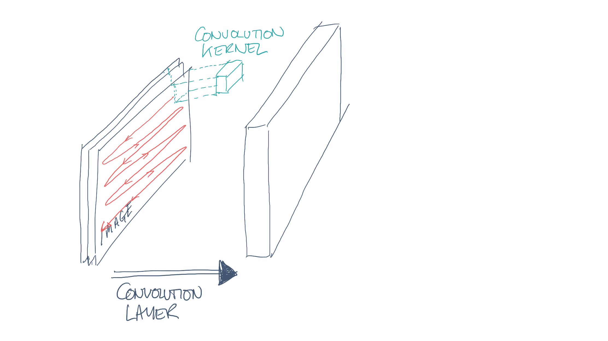

# [fit] Core ML:
# [fit] a __whistlestop__
# [fit] tour

---

# [fit] Core
# [fit] ML

---

> With Core ML, you can integrate trained machine learning models into your app.
-- devloper.apple.com

---

---

---

# [fit] classification

## __tell me which of these groups the input falls into__

---

# [fit] regression

## __estimate an output value given this input__

---

# [fit] clustering

## __how many different classes does the data fall into?__

---

# [fit] __1__
# [fit] collect
# [fit] data

---

# [fit] __2__
# [fit] ground
# [fit] truth

---

# [fit] __3__
# [fit] feature
# [fit] vectors

---

# [fit] __4__
# [fit] train
# [fit] model

---

# [fit] __5__
# [fit] test
# [fit] model

---

# [fit] __6__
# [fit] repeat
# [fit] __3__, __4__ & __5__

---

# [fit] __7__
# [fit] deploy
# [fit] model

---

# [fit] __8__
# [fit] perform
# [fit] prediction

---

# [fit] Machine Learning

1. Collect data
2. Ground truth
3. Feature vectors
4. Train model
5. Test model
6. Repeat 3, 4 & 5
7. Deploy model
8. Perform prediction

---

# [fit] Machine Learning

1. _Collect data_
2. _Ground truth_
3. _Feature vectors_
4. _Train model_
5. _Test model_
6. _Repeat 3, 4 & 5_
7. __Deploy model__
8. __Perform prediction__

---

# [fit] Linear Regression
# [fit] _Support Vector Machine_
# [fit] __Tree Ensembles__
# [fit] Bayesian Networks
# [fit] __Neural Networks__

---

# [fit] Core ML provides
# [fit] an __abstraction__
# [fit] across __different__
# [fit] model types

---

# [fit] model
# [fit] interchange
# [fit] __format__

---

# [fit] device
# [fit] optimised
# [fit] __implementation__

---

# [fit] consistent
# [fit] __API__

---

# [fit] that just leaves
# [fit] the __hard__
# [fit] part

---

# [fit] __SVM__
# [fit] _support vector machine_

---

---

---

# [fit] __example:__
# [fit] sentiment
# [fit] analysis

---

# [fit] __bag__
# [fit] _of_
# [fit] __words__

---

# [fit] demo

---

# [fit] convolutional
# [fit] neural
# [fit] networks

---

# 

---

# 

---

# 

---

# 

---

# 

---

# 

---

# 

---

# 

---

# 

---

# 

---

# 

---

# 

---

# 

---

# [fit] __example:__
# [fit] salient
# [fit] object
# [fit] subitizing

---

# [fit] demo

---

# [fit] conclusion

---

# [fit] __Core ML__ is
# [fit] a __small__ part
# [fit] of the story

---

# [fit] __useful__
# [fit] nonetheless

---

# [fit] _format_
# [fit] __optimisation__
# [fit] API

---

# potentially
# [fit] __exciting__
# [fit] times

---

# [fit] __github.com/sammyd__
# [fit] /iOSCon2018_WhistlestopCoreML
# [fit] _-_
# [fit] _@iwantmyrealname_

